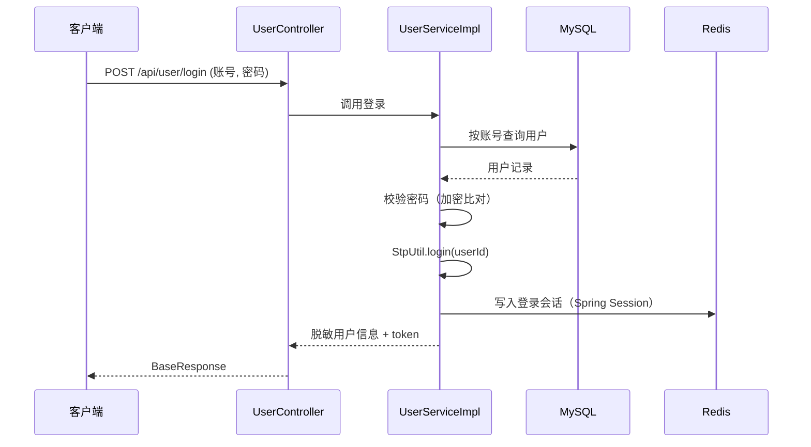
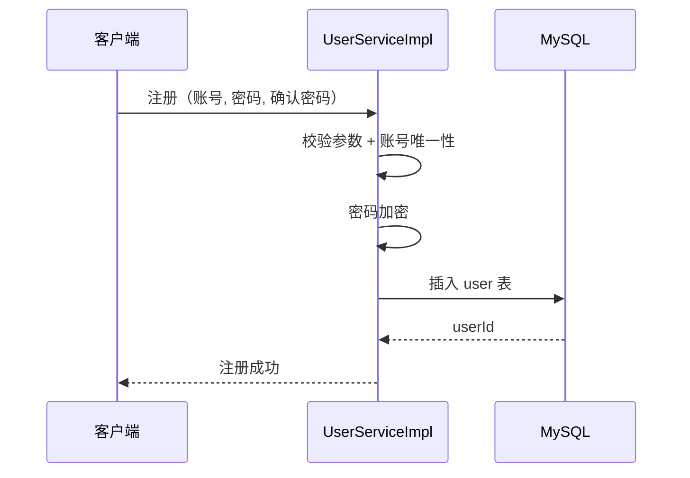
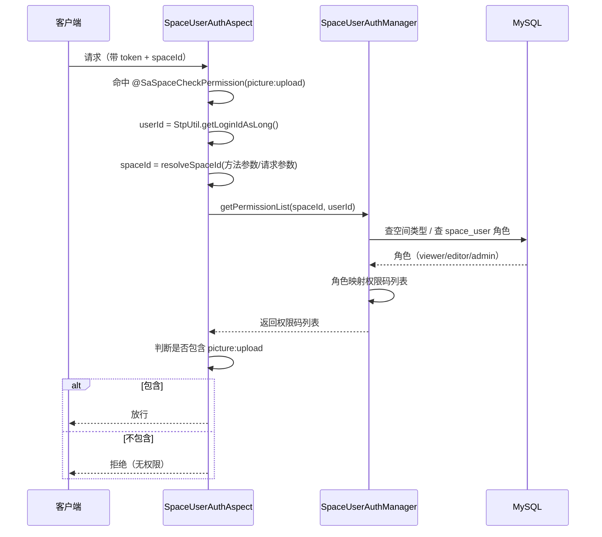
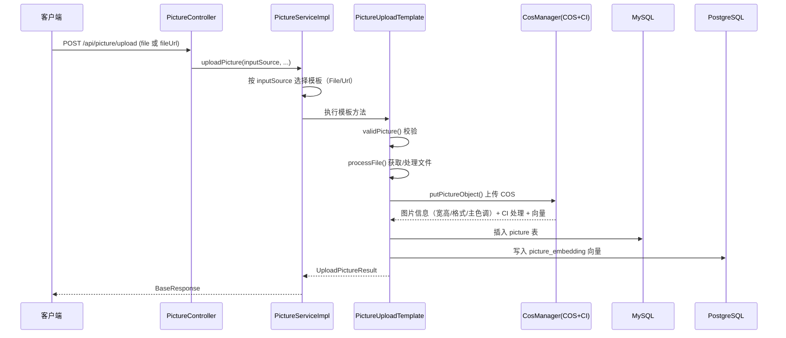
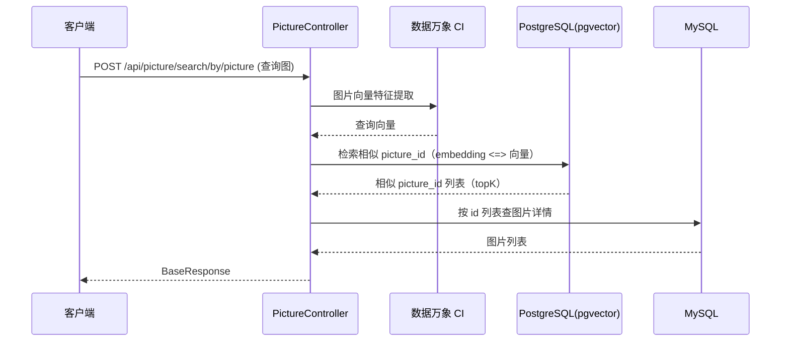
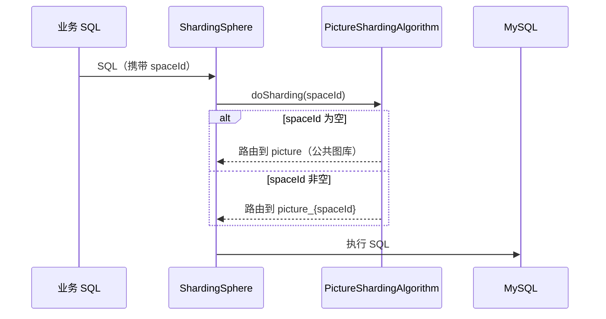

# 云图库详细设计文档

## 一、用户认证流程

### 1. 登录流程

说明：登录态存 Redis，由 Spring Session 托管，实现分布式会话。

### 2. 注册流程

## 二、空间权限鉴权流程（核心）

说明：权限「配置化 + 注解化 + 切面化」，公共/私有/团队三种场景在 `SpaceUserAuthManager.getPermissionList` 里分支收敛。

## 三、图片上传流程（核心）

### 1. 模板方法执行流程

### 2. 关键步骤

1. `validPicture()`：文件大小 ≤ 2MB、格式校验（jpeg/png/jpg/webp）。
2. `processFile()`：本地文件转存临时文件，或 URL 下载到本地。
3. `CosManager.putPictureObject()`：上传 COS + CI 完成 webp 压缩、缩略图、宽高/主色调提取、向量特征提取。
4. 双写：MySQL `picture` 存元数据，PostgreSQL `picture_embedding` 存向量。MySQL 写入走本地事务，PG 与 COS 采用最终一致（补偿 + 对账），详见《事务设计文档》。

## 四、以图搜图流程（核心）

说明：向量检索只返回 `picture_id`，图片详情以 MySQL 为准，两库职责清晰。

## 五、分表路由流程

说明：按 `space_id` 分表，团队空间图片落到 `picture_{spaceId}`。

## 六、关键类职责汇总

| 类 | 职责 |
| --- | --- |
| `UserServiceImpl` | 注册 / 登录 / 脱敏 |
| `PictureServiceImpl` | 图片上传 / 搜索 / 批量抓取 / 以图搜图 / 按颜色搜索 |
| `SpaceServiceImpl` | 空间创建 / 编辑 / 删除 |
| `SpaceAnalyzeServiceImpl` | 空间使用 / 分类 / 标签 / 大小 / 排行统计 |
| `SpaceUserAuthManager` | 空间成员与权限管理 |
| `SpaceUserAuthAspect` | 拦截 `@SaSpaceCheckPermission` 完成空间权限校验 |
| `PictureUploadTemplate` | 上传流程模板方法 |
| `FilePictureUpload` / `UrlPictureUpload` | 本地 / URL 上传子类 |
| `CosManager` | COS 存储 + CI 图片处理封装 |
| `ColorSimilarUtils` | 主色调 hex 转 RGB 与 RGB 欧氏距离计算 |
| `PictureShardingAlgorithm` | 自定义分片算法 |
| `DynamicShardingManager` | 动态建表 + 分片规则刷新 |
| `TwoLevelCacheManager` / `TwoLevelCache` | Caffeine + Redis 两级缓存 |
| `GlobalExceptionHandler` | 统一异常处理 |
| `BaseResponse` / `ResultUtils` | 统一返回 |
